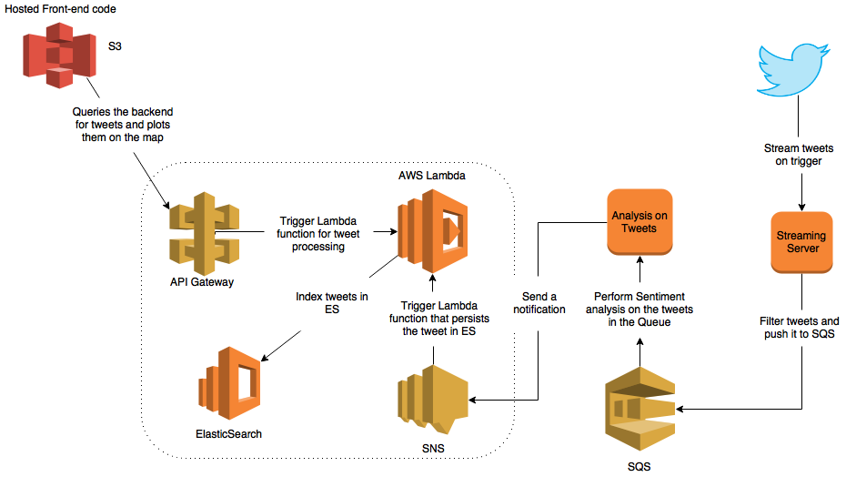

# TweetTrends

TweetTrends is a web application where you can search Twitts and represent the Twitts on GoogleMaps.

**Demo**

http://tweet-trends-static-website.s3-website-us-west-2.amazonaws.com/

**Objectives**

1) Use the Amazon SQS service - <https://aws.amazon.com/sqs/> to create a processing queue for the Tweets that are delivered by the Twitter Streaming API

2) Use Amazon SNS service - <https://aws.amazon.com/sns/> to update the status processing on each tweet so the UI can refresh.

3) Integrate sentiment analysis into the Tweet processing flow.

4) Use Amazon Lambda service - [https://aws.amazon.com/lambda/](https://aws.amazon.com/lambda) to create functions for functionalities wherever necessary.

**Architecture Diagram**

**Streaming**

Read a stream of tweets from the Twitter Streaming API. Note: you might follow a set of specific keywords that you find interesting
After fetching a new tweet, check to see if it has geolocation info and is in English. (Bounding box can be made use of if a tweet has no location)
Once the tweet validates these filters, send a message to SQS - <http://docs.aws.amazon.com/AWSSimpleQueueService/latest/SQSDeveloperGuide/Welcome.html> for asynchronous processing on the text of the tweet

**Processing**

Make a call to the sentiment analysis API of your preference (e.g. IBM Watson API - <https://www.ibm.com/watson/services/natural-language-understanding/>). This can return a positive, negative or neutral sentiment evaluation for the text of the submitted Tweet.
As soon as the tweet is processed send a notification that contains the information about the tweet, to an SNS topic. Use a lambda function that gets triggered for any notifications to the topic. 

**Backend**

On receiving the notification, index this tweet in Elasticsearch. Make sure you preserve the sentiment of the tweet as well.

The whole of backend must be implemented as Lambda functions. For example, 
Streaming functionality must be a lambda function and must be invoked for every request from the front-end for a specific keyword.

Lambda Developers Guide : <http://docs.aws.amazon.com/lambda/latest/dg/lambda-dg.pdf>

Udemy Lambda tutorial : <https://www.udemy.com/aws-lambda-2016-the-complete-guide-with-hands-on-labs/>

More on Lambda : <https://www.youtube.com/playlist?list=PLzvRQMJ9HDiSQMe68cti8cupI0mzLk1Gc>. 

You might want to look into Step Functions - <https://aws.amazon.com/step-functions/>, for visualizing a workflow of multiple lambda functions.

**Front-end**

Give the user the ability to search tweets via a text input or a dropdown.
When a new tweet is indexed, provide visual indication on the frontend (Something like a Facebook notification - Can make use of SNS). 
Plot the tweets that match the query on a map. (use markers <https://developers.google.com/maps/documentation/javascript/markers>)
Lastly, use a custom marker <https://developers.google.com/maps/documentation/javascript/custom-markers> to indicate the sentiment. Alternatively, you can come up with any other style to represent the sentiment of the tweet.

The Front-end code must be hosted in Amazon S3 - <http://docs.aws.amazon.com/AmazonS3/latest/dev/WebsiteHosting.html>